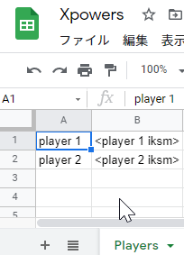

# apps-script-x-power-tracker

> Track daily X Power change with Google Spreadsheet

## Installation

In order to use clasp CLI, you need to enable the "Google Apps Script API" in
["Apps Script" settings](https://script.google.com/home/usersettings) first.

```sh
# Install clasp CLI if not installed
$ npm i -g @google/clasp

# Create Apps Script attached to a Spreadsheet
$ clasp create xpowers --type Spreadsheet --title "X Powers Tracker"

# Create `.env` file and set `SPLATNET_API_URL` field
$ cp .env.example .env
$ $EDITOR .env
SPLATNET_API_URL=https://[redacted]/api

# Build and push the script
$ npm run push
```

After successfully pushing the script, you need to create a sheet named "Players" (**case-sensitive**) in the following format:

|       | A                        | B                        |
| ----- | ------------------------ | ------------------------ |
| **1** | `<first account's name>` | `<first account's iksm>` |
| ...   |                          |                          |
| **n** | `<nth account's name>`   | `<nth account's iksm>`   |

Please see the image below for example:  


- You can have as many accounts as you wish (though excessive number of players might hit the [Google Apps Script quota(s)](https://developers.google.com/apps-script/guides/services/quotas)).
- The name will be used in sheet's name.
  - Changing player name is **NOT** recommended, as it won't rename old sheets.
- Do not include `<` or `>` in actual data.

## Notes

- If you want to share sheets with other people, you should make the "Players" sheet invisible. (Only Google account's with editor permission can view the sheet).  
  See [Protect, hide, and edit sheets - Docs Editors Help](https://support.google.com/docs/answer/1218656) for further information.

  **Warning**: Please be careful that the sheet will become and stay visible whenever you open the sheet.
  Do not forget to hide the sheet again to avoid revealing iksm accidentally.

  **Note**: Since version 1.0.1, this script hides "Players" sheet if the sheet is visible.

- This project uses [yukidaruma/esbuild-apps-script-template](https://github.com/yukidaruma/esbuild-apps-script-template) as a template.
